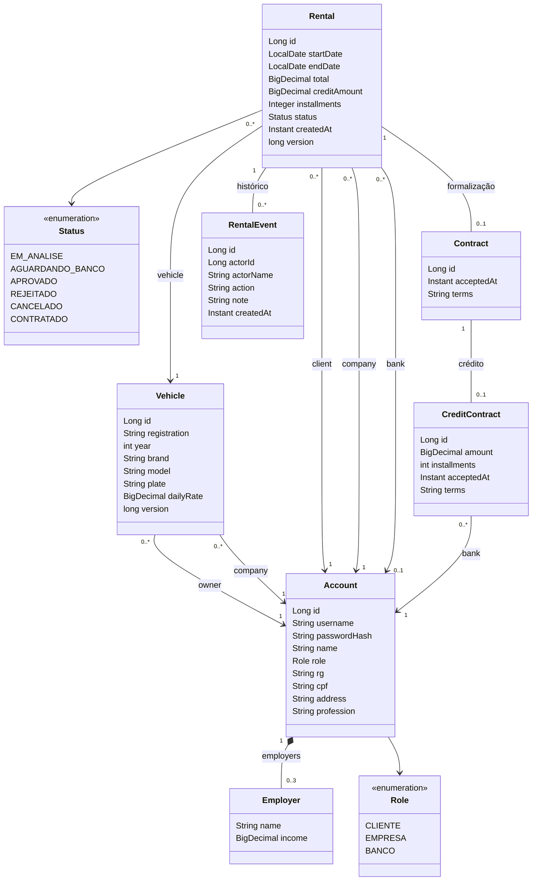

# Diagrama de classes — V2

```mermaid
classDiagram
    class Account {
      Long id
      String username
      String passwordHash
      String name
      Role role
      String rg
      String cpf
      String address
      String profession
    }
    class Employer {
      String name
      BigDecimal income
    }
    class Role {
      <<enumeration>>
      CLIENTE
      EMPRESA
      BANCO
    }
    class Vehicle {
      Long id
      String registration
      int year
      String brand
      String model
      String plate
      BigDecimal dailyRate
      long version
    }
    class Status {
      <<enumeration>>
      EM_ANALISE
      AGUARDANDO_BANCO
      APROVADO
      REJEITADO
      CANCELADO
      CONTRATADO
    }
    class Rental {
      Long id
      LocalDate startDate
      LocalDate endDate
      BigDecimal total
      BigDecimal creditAmount
      Integer installments
      Status status
      Instant createdAt
      long version
    }
    class Contract {
      Long id
      Instant acceptedAt
      String terms
    }
    class CreditContract {
      Long id
      BigDecimal amount
      int installments
      Instant acceptedAt
      String terms
    }
    class RentalEvent {
      Long id
      Long actorId
      String actorName
      String action
      String note
      Instant createdAt
    }
    Account "1" *-- "0..3" Employer : employers
    Account --> Role
    Vehicle "0..*" --> "1" Account : owner
    Vehicle "0..*" --> "1" Account : company
    Rental "0..*" --> "1" Account : client
    Rental "0..*" --> "1" Account : company
    Rental "0..*" --> "0..1" Account : bank
    Rental "0..*" --> "1" Vehicle : vehicle
    Rental --> Status
    Rental "1" -- "0..1" Contract : formalização
    Contract "1" -- "0..1" CreditContract : crédito
    CreditContract "0..*" --> "1" Account : bank
    Rental "1" -- "0..*" RentalEvent : histórico
```
